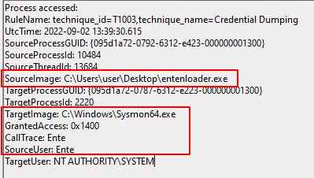

# SysmonEnte 

This is a POC attack on the integrity of Sysmon which emits a minimal amount of observable events even if a ```SACL``` is in place.   
To our understanding, this attack is difficult to detect in environments where no security sensors other than Sysmon or the Windows Event Log are in use.

For more technical information on the attack and possible mitigations, please see [our blogpost](https://codewhitesec.blogspot.com/2022/09/attacks-on-sysmon-revisited-sysmonente.html).

## Motivation

Multiple different attacks on Sysmon or the Event Log service exist. To the best of our knowledge, all of these are detectable using Sysmon or the Event Log itself:

* Driver (Un)Loading.
* Registry changes.
* Process Access events.
* Lack of events from certain hosts.
* ...

Motivated defenders can observe the corresponding events to identify attacks on Sysmon or the Event Log service.   
Our goal was to create an attack on Sysmon which is difficult to fingerprint as no suspicious events are emitted during the attack.

## Description

Similarly to [SysmonQuiet](https://github.com/ScriptIdiot/SysmonQuiet) or [EvtMute](https://github.com/bats3c/EvtMute), the idea is to inject code into Sysmon which redirects the execution flow in such a way that events can be manipulated before being forwarded to the SIEM.  

However, during this attack, **no suspicious ProcessAccess events on Sysmon are observable via Sysmon or the Event Log** making the detection (supposedly) non trivial.

The attack flow is as follows:

* Suspend all threads of Sysmon.
* Create a limited handle to Sysmon and elevate it by duplication. 
* Clone the pseudo handle of Sysmon to itself in order to bypass ```SACL``` as proposed by [James Forshaw](https://www.tiraniddo.dev/2017/10/bypassing-sacl-auditing-on-lsass.html).
* Inject a hook manipulating all events (in particular ProcessAccess events on Sysmon).
* Resume all threads.



## Usage

SysmonEnte is implemented as fully position independent code (PIC) which can be called using the following prototype:

```C
DWORD go(DWORD dwPidSysmon);
```

A sample loader is included and built during compilation when typing ```make```.

```
.\EntenLoader.exe <PID Sysmon>
```

Additionally, SysmonEnte uses [indirect syscalls](https://github.com/thefLink/RecycledGate) to bypass possible userland hooks.

The open source variant tampers with process access events to Lsass and Sysmon and sets the access mask to a benign one. Additionally, the source user and the callstack is set to **Ente**. You can change these to your needs.

## Detections

To our understanding, the ```SACL``` bypass by James Forshaw can be identified by configuring a ```SACL``` with ```PROCESS_DUP_HANDLE``` on Sysmon. ```Event 4656``` should then be emitted upon the instantiation of a handle allowing to clone other handles from Sysmon.

However, configuring such a ```SACL``` using well known administration tools appears to be non trivial. A sample program to set such a ```SACL``` is included in the folder ```SACLProtect```.
Note that ```Object Access Auditing``` is not enabled by default.

## References

* Implementation by our [@testert01](https://twitter.com/testert01) and [@thefLinkk](https://twitter.com/thefLinkk)
* [SysmonQuiet](https://github.com/ScriptIdiot/SysmonQuiet) by [Scriptidiot](https://twitter.com/5cript1diot)
* [EvtMute](https://github.com/bats3c/EvtMute) by [Batsec](https://twitter.com/_batsec_)
* [James Forshaw's SACL Bypass](https://www.tiraniddo.dev/2017/10/)

### Trivia

Ente means duck in German.
